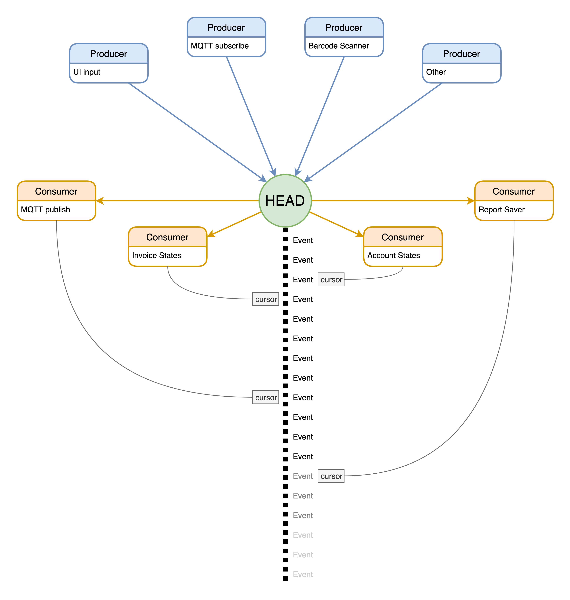

# streamkt
The event streaming part of the Spuyt eco-system




## IntelliJ

To build, test, and create a .jar file, use the Gradle tasks menu:

 - Gradle tab on the top right of the IDE
 - streamkt
 - Tasks
 - build -> build/jar/etc.


#### run jar from the command line
```
java -jar build/libs/streamkt.jar
```


## Command line

You can use the project specific gradle binary `gradlew` to build the project with the following commands.

#### show tasks
```
./gradlew tasks
```

#### build and test
```
./gradlew build
```

#### build jar
```
./gradlew jar
```

#### run jar
```
java -jar build/libs/streamkt.jar
```


## create the default MySQL database using Docker

When no specific settings are provided, streamkt will try to connect to this local MySQL server:

 - docker image name: **streamkt-mysql-dev**

 - username: **root**
 - password: **streamkt-dev-pw**
 - database: **streamkt**
 - port: **33060**

#### To create this database using Docker use the following command:

```
docker run --name streamkt-mysql-dev \
-p 3306:33060 \
-e MYSQL_ROOT_PASSWORD=streamkt-dev-pw \
-e MYSQL_DATABASE=streamkt \
-d mysql:8.0.20
```

### connect to the dev database

In case you want to connect to the local temporary mysql database to inspect it, run these commands:

For Ubuntu
```
sudo apt install mysql-client
```

For OSX
```
brew install mysql-client
echo 'export PATH="/usr/local/opt/mysql-client/bin:$PATH"' >> $HOME/.bash_profile
source $HOME/.bash_profile
```

connect
```
mysql -u root -p'streamkt-dev-pw' -P 33060 -h 127.0.0.1
```


